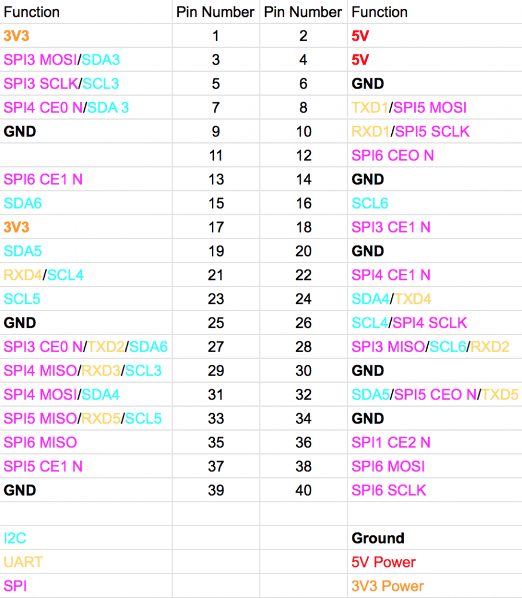

# Configurazioni

## Connessione WiFi

1. Editare il file supplicant da raspberry `sudo nano /etc/wpa_supplicant/wpa_supplicant.conf` oppure creare un file chiamato `wpa_supplicant.conf` nella partizione `/boot` della schedina sd.
2. Riempire il file con il seguente contenuto:

```txt
country=IT
network={
    ssid="nome-rete"
    psk="password-rete"
}
```

## Abilitare SSH

Dopo avere formattato la scheda sd inserire un file chiamato `ssh` dentro la partizione `/boot`.

## Abilitare più seriali

Nel file `/bbot/config.txt` aggiungere queste righe:

```conf
[all]
#dtoverlay=vc4-fkms-v3d
enable_uart=1
dtoverlay=uart2 # abilita la uart 2
dtoverlay=uart3 # abilita la uart 3
dtoverlay=uart4 # abilita la uart 4
dtoverlay=uart5 # abilita la uart 5
```

| Numero UART | Pin TX | Pin RX | Nome seriale |
| --- | --- | --- | --- |
| 1 | 8 | 10 | `/dev/ttyS0` o `/dev/ttyAMA0` |
| 2 | 27 | 28 | `/dev/ttyAMA1` |
| 3 | ? | 29 | `/dev/ttyAMA3` da testare |
| 4 | 24 | 21 | `/dev/ttyAMA4` |
| 5 | 32 | 33 | `/dev/ttyAMA5` |

[Per maggiori info](https://www.raspberrypi.org/forums/viewtopic.php?f=44&t=246728&hilit=serial#p1506953)


*In giallo sono marchiate le seriali*

## Aumento del baudrate dell'accelerometro (per migliorare le prestazioni)

Aggiungere la linea:
   `dtparam=i2c_arm=on,i2c_arm_baudrate=400000`
nel file:
   `boot/config.txt`
